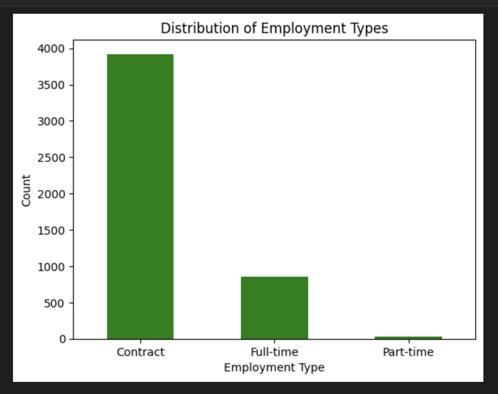
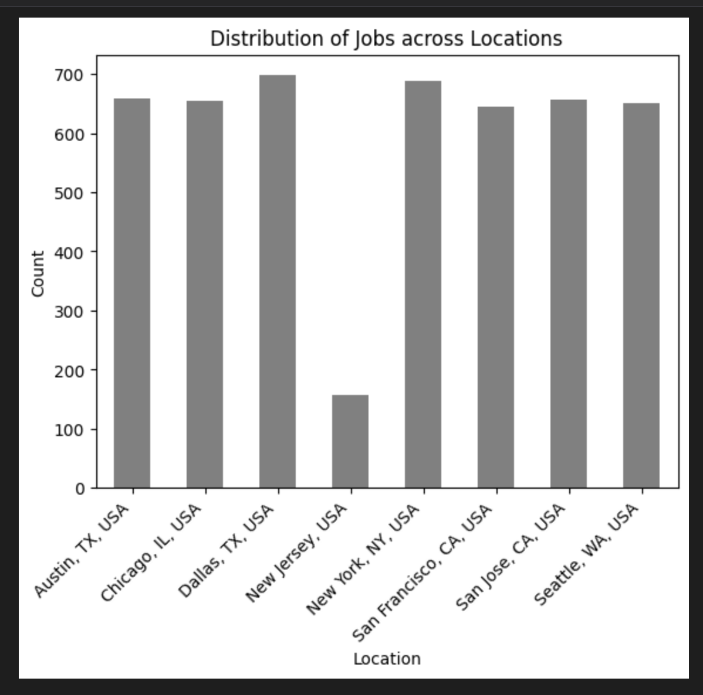
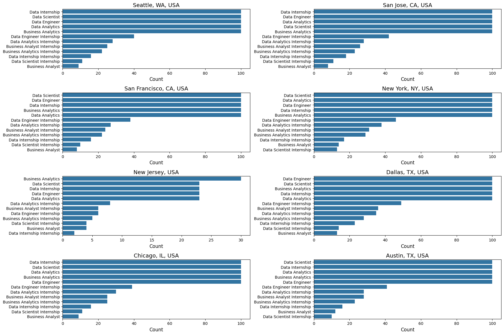
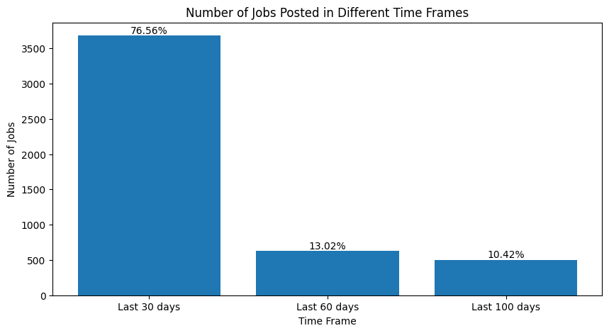
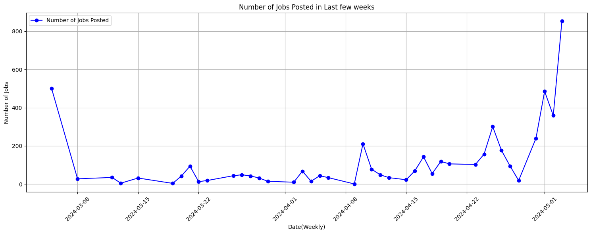
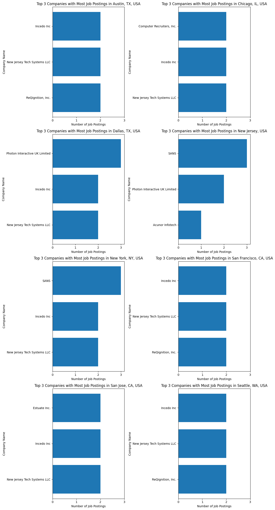

# 📊 Dice Jobs Analytical Report – Job Market Insights via Web Scraping

**Created by:** Mahima Advilkar  
**Role:** Data Analyst   
**Domain:** Job Market Trend Analytics Intelligence | Data Analytics 
**Tools Used:** Python, BeautifulSoup, Pandas, NumPy, Tableau, Seaborn, Matplotlib, Excel

---

## 📌 Project Overview

This project dives into the dynamic tech job landscape across major U.S. cities including San Francisco, New York, New Jersey, San Jose, and Seattle. Using a Python-based ETL pipeline and web scraping from Dice.com, over 4,773 job listings were collected and analyzed to uncover trends in employment types, job roles, skill demands, remote vs onsite preferences, company hiring patterns, and seasonal spikes in recruitment.

---

## 🧰 Tools & Technologies

- `Python`, `Pandas`, `NumPy` – Data analysis  
- `BeautifulSoup` – Web scraping  
- `Matplotlib`, `Seaborn` – Visualization   
- `Excel` – Aggregation and summaries  

---

## 🌐 Data Collection Strategy

- Website: [Dice.com](https://www.dice.com)  
- Total Listings: ~4,773 job postings  
- Fields Extracted:
  - Job Title  
  - Company  
  - Location  
  - Employment Type  
  - Work Format (Remote / Hybrid / Onsite)  
  - Posting Date & Duration  
  - Skills Required  
  - "Easy Apply" Tag  
  - Distance Filters (25 miles from city center)

---

## 🔍 Research Questions

- What job types (full-time, contract, part-time) dominate the market?  
- Which cities are the strongest job hubs?  
- What are the top trending job titles?  
- Which roles are offered remotely vs. onsite?  
- What are the top skills in demand?  
- What seasonal/temporal trends exist in job postings?

---

## 📊 Key Insights (From Visuals & Data)

- **Contract roles dominate** (~3,900 listings), with full-time roles around 850  
- **Top job cities**: Dallas, New York, Austin, San Jose, Seattle  
- **In-demand roles**: Data Analyst, Data Engineer, Cloud Developer  
- **Internship opportunities** are concentrated in San Jose and NYC  
- **Remote jobs make up over 50%** of total listings  
- **Hiring surged by 265%** in the last 30 days compared to the previous 30  
- **Top companies** vary by region and role

---

## 📈 Visualizations

> *(Make sure these are added to a `/visuals/` folder in your repo)*

### 1. Employment Type Distribution

  
### 2. Jobs by Location

### 3. Word Cloud of Job Titles  

### 4. Job Titles by Location  

### 5. Job Postings in 30/60/90 Day Windows  

### 6. Weekly Posting Trends 

### 7. Company-wise Job Count by City 

---

## 📁 Files Included

| File | Description |
|------|-------------|
| `Data-Analysis.ipynb` | Full scraping, cleaning, analysis notebook |
| `Dice_Jobs_Analysis_Report.pdf` | Summary PDF with all insights and charts |
| `dice_jobs_raw_data.csv` | Scraped dataset (if included) |
| `visuals/` | PNG images of all charts |
| `README.md` | This documentation |

---

## 🧠 Future Enhancements

- Add NLP for job description clustering  
- Automate weekly/monthly scraping via CRON or cloud  
- Deploy with a live Streamlit app for interactivity  

---

## 🔗 Tableau Dashboard

📍 *Add link here if published to Tableau Public*

---

> ⭐ If this helped or inspired you, feel free to fork it, star it, or connect with me!
